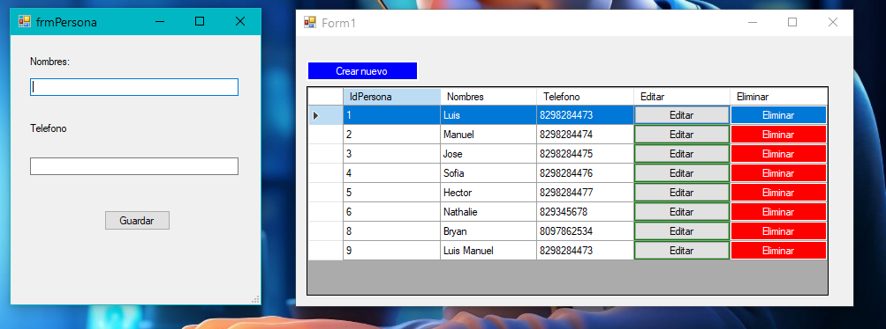

# CRUD de Personas en C#

Este proyecto es una aplicación de escritorio desarrollada en C# que permite gestionar un sistema CRUD (Crear, Leer, Actualizar y Eliminar) de personas utilizando Windows Forms y Entity Framework para la gestión de la base de datos.



## Descripción

La aplicación permite a los usuarios:
- Crear nuevos registros de personas.
- Leer y visualizar la lista de personas.
- Actualizar la información de las personas existentes.
- Eliminar registros de personas.

## Estructura del Proyecto

- **Base de Datos - Sql Server**:
  -  Contiene las instrucciones SQL para crear la base de datos `DBPRUEBAS` y la tabla `PERSONA`, así como algunos registros iniciales.

- **Interfaz de Usuario**:
  - `Form1.cs`: Clase principal que maneja la interfaz de usuario y la lógica de negocio.
  - `Form1.Designer.cs`: Contiene el diseño de la interfaz de `Form1`.
  - `frmPersona.cs`: Clase para crear y editar registros de personas.
  - `frmPersona.Designer.cs`: Contiene el diseño de la interfaz de `frmPersona`.

- **Entity Framework**:
  - Se utiliza Entity Framework para la gestión de datos, facilitando las operaciones CRUD y la conexión a la base de datos.

## Requisitos

- .NET Framework 4.5 o superior
- SQL Server para la gestión de la base de datos
- Entity Framework

## Instalación

1. Clona el repositorio:
   ```bash
   git clone https://github.com/luismanuelcldev/CRUD_CSharp.git
   ```
2. Abre el proyecto en Visual Studio.
3. Asegúrate de que la base de datos esté configurada correctamente utilizando el archivo SQL proporcionado.
4. Ejecuta la aplicación.

## Uso

- Al iniciar la aplicación, se mostrará una lista de las personas registradas.
- Puedes hacer clic en "Crear nuevo" para agregar una nueva persona.
- Para editar o eliminar una persona, selecciona la fila correspondiente en el `DataGridView`.


## Licencia

Este proyecto está licenciado bajo la Licencia MIT. Consulta el archivo [LICENSE](LICENSE) para más detalles.
